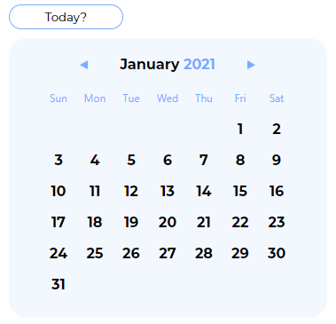

<p></p>
<h1>Calenda</h1>

A solution for your date management. We've abstracted the complexities of calculating dates for you to use through our easy to use light-weight library. Build your time management apps faster.

## Sample

> Head over to the [official website](https://calenda-website.web.app/) for an interactive demonstration.


<a href="#"></a>

- [Publication](https://calenda.web.app)

* [How it works](#How-it-works)
  + [Initialization](#Step-1:-Initialization)
  + [Get the month structure](#Step-2:-Get-the-month-structure)
  + [Get information](#Step-3:-Get-information)
  + [Time travel](#Step-4:-Time-travel)

## How it works

### Step 1: Initialization
- Run the command
```
npm install calenda
```
- Import calenda into your project
```
Import Calenda from 'calenda'
```
- Create a `new` Calendar instance and pass in an object with a `month` property set to any month of the year.

> Note: The year defaults to the current year you are in.

```
const calendar = new Calenda({
  month: 'January'
});
```

### Step 2: Get the month structure
- Call the `getStructure` method on the instance and get the `structure` property.
```
calendar.getStructure().structure;
```

> This returns an object of arrays with the days of the week as keys and an array of numbers as values which are the days of the month that fall on that day of the week.

```
{
  Sun: [ 0, 3, 10, 17, 24, 31 ],
  Mon: [ 0, 4, 11, 18, 25 ],
  Tue: [ 0, 5, 12, 19, 26 ],
  Wed: [ 0, 6, 13, 20, 27 ],
  Thu: [ 0, 7, 14, 21, 28 ],
  Fri: [ 1, 8, 15, 22, 29 ],
  Sat: [ 2, 9, 16, 23, 30 ]
}
```

### Step 3: Get information
-  Chain the `getInfo` method with the `getStructure` method and passing in a day of the month as a number as he first argument and an object with a set of options specifying the information you would like to get as the second argument.
```
calendar.getStructure().getInfo(1, {
  dayNumber: true,
  dayOfWeek: true,
  monthOfYear: true,
  year: true,
  suffix: true
})
```

> This returns an object with the values of the specified options.

```
{
   dayNumber: 1,
   dayOfWeek: 'Fri',
   monthOfYear: 'January',
   year: 2021,
   suffix: 'st'
}
```

### Step 4: Time travel
-  You can move forward or backward from the current month by calling the
`moveMonth` method on the `calendar` object with either `forward` or
`backward` as a string argument on the method. This method can be chained with other
methods including itself to get your desired results.
```
calendar.moveMonth('forward').getStructure().getInfo(1, {
  dayNumber: true,
  dayOfWeek: true,
  monthOfYear: true,
  year: true,
  suffix: true
})
```

> This returns an object with the values of the specified options of the  next month `February`.

```
{
   dayNumber: 1,
   dayOfWeek: 'Mon',
   monthOfYear: 'February',
   year: 2021,
   suffix: 'st'
}
```
> The same applies for moving backwards.

## Additional information

### Support us

#### Contribute
  * [Github issues](https://github.com/redbossrabbit/Calenda/issues)
  
#### Sponsor
  * [Patreon](https://patreon.com/qubeblox)

